### Uso de Amazon API Gateway para invocar funciones Lambda

## Descripción General
| Encabezado  | Descripción |
| ----------- | ----------- |
| Descripción | Explica cómo desarrollar una función AWS Lambda usando la API de tiempo de ejecución de Java y luego cómo invocarla usando Amazon API Gateway. |
| Audiencia   | Desarrollador (principiante / intermedio) |
| Habilidades Requeridas   | Java, Maven |

## Propósito
Puedes invocar una función AWS Lambda utilizando Amazon API Gateway, que es un servicio de AWS para crear, publicar, mantener, monitorear y asegurar APIs REST, HTTP y WebSocket a escala. Los desarrolladores de API pueden crear APIs que acceden a AWS u otros servicios web, así como a datos almacenados en la nube de AWS. Como desarrollador de API Gateway, puedes crear APIs para usar en tus propias aplicaciones cliente. Para más información, consulta [¿Qué es Amazon API Gateway](https://docs.aws.amazon.com/apigateway/latest/developerguide/welcome.html).

Lambda es un servicio de cómputo que te permite ejecutar código sin aprovisionar ni gestionar servidores. Puedes crear funciones Lambda en varios lenguajes de programación. Para más información sobre AWS Lambda, consulta [¿Qué es AWS Lambda](https://docs.aws.amazon.com/lambda/latest/dg/welcome.html).

En este tutorial, crearás una función Lambda utilizando la API de tiempo de ejecución de Java de AWS Lambda. Este ejemplo invoca diferentes servicios de AWS para realizar un caso de uso específico. Por ejemplo, supón que una organización envía un mensaje de texto móvil a sus empleados felicitándolos en la fecha de su primer aniversario, como se muestra en esta ilustración.


Este tutorial te muestra cómo usar lógica en Java para crear una solución que realice este caso de uso. Por ejemplo, aprenderás cómo leer una base de datos para determinar qué empleados han alcanzado la fecha de su primer aniversario, cómo procesar los datos y enviar un mensaje de texto, todo usando una función Lambda. Luego aprenderás cómo usar Amazon API Gateway para invocar esta función Lambda utilizando un endpoint REST. Por ejemplo, puedes invocar la función Lambda usando este comando curl:

      curl -XGET "https://xxxxqjko1o3.execute-api.us-east-1.amazonaws.com/cronstage/employee" 

Este tutorial de AWS utiliza una tabla de Amazon DynamoDB llamada **Employee** que contiene estos campos:

- **Id** – la clave de la tabla.
- **first** – el nombre del empleado.
- **phone** – el número de teléfono del empleado.
- **startDate** – la fecha de inicio del empleado.

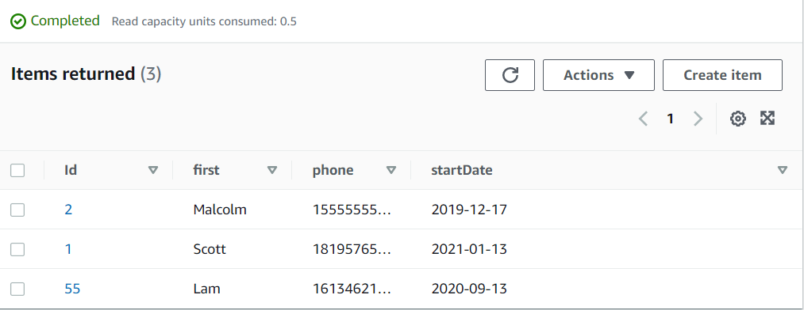

**Nota**: Para aprender cómo invocar una función AWS Lambda usando eventos programados, consulta [Crear eventos programados para invocar funciones Lambda](https://github.com/awsdocs/aws-doc-sdk-examples/tree/master/javav2/usecases/creating_scheduled_events).

#### Temas
+ Requisitos previos
+ Crear un rol de AWS Identity and Access Management (IAM) que se usa para ejecutar funciones Lambda
+ Crear un proyecto de IntelliJ llamado **LambdaCronFunctions**
+ Añadir las dependencias POM a tu proyecto
+ Crear una función AWS Lambda utilizando la API de tiempo de ejecución de AWS Lambda
+ Empaquetar el proyecto que contiene la función AWS Lambda
+ Desplegar la función AWS Lambda
+ Configurar Amazon API Gateway para invocar la función Lambda

## Requisitos previos
Para seguir este tutorial, necesitas lo siguiente:
+ Una cuenta de AWS con las credenciales adecuadas.
+ Un IDE de Java (para este tutorial se utiliza IntelliJ IDE).
+ JDK de Java 1.8.
+ Maven 3.6 o superior.

### Importante

+ Los servicios de AWS incluidos en este documento están incluidos en el [nivel gratuito de AWS](https://aws.amazon.com/free/?all-free-tier.sort-by=item.additionalFields.SortRank&all-free-tier.sort-order=asc).
+ Este código no ha sido probado en todas las regiones de AWS. Algunos servicios de AWS están disponibles solo en regiones específicas. Para más información, consulta [Servicios Regionales de AWS](https://aws.amazon.com/about-aws/global-infrastructure/regional-product-services). 
+ Ejecutar este código puede resultar en cargos en tu cuenta de AWS. 
+ Asegúrate de terminar todos los recursos que creas durante este tutorial para garantizar que no se te cobren.

### Creación de los recursos

Una tabla de Amazon DynamoDB llamada **Employee** con una clave llamada **Id** y los campos mostrados en la ilustración anterior. Asegúrate de ingresar los datos correctos, incluyendo un número de teléfono móvil válido con el que quieras probar este caso de uso. Para aprender cómo crear una tabla DynamoDB, consulta [Crear una tabla](https://docs.aws.amazon.com/amazondynamodb/latest/developerguide/getting-started-step-1.html).

## Crear un rol IAM para ejecutar funciones Lambda

Crea el siguiente rol IAM:

+ **lambda-support** - Usado para invocar funciones Lambda.

Este tutorial utiliza los servicios DynamoDB y Amazon SNS. El rol **lambda-support** debe tener políticas que le permitan invocar estos servicios desde una función Lambda.  

#### Para crear un rol IAM

1. Abre la Consola de Administración de AWS. Cuando la página se cargue, ingresa **IAM** en el cuadro de búsqueda y luego elige **IAM** para abrir la consola IAM.

2. En el panel de navegación, elige **Roles**, y en la página **Roles**, elige **Crear rol**.

3. Elige **Servicio de AWS**, y luego elige **Lambda**.

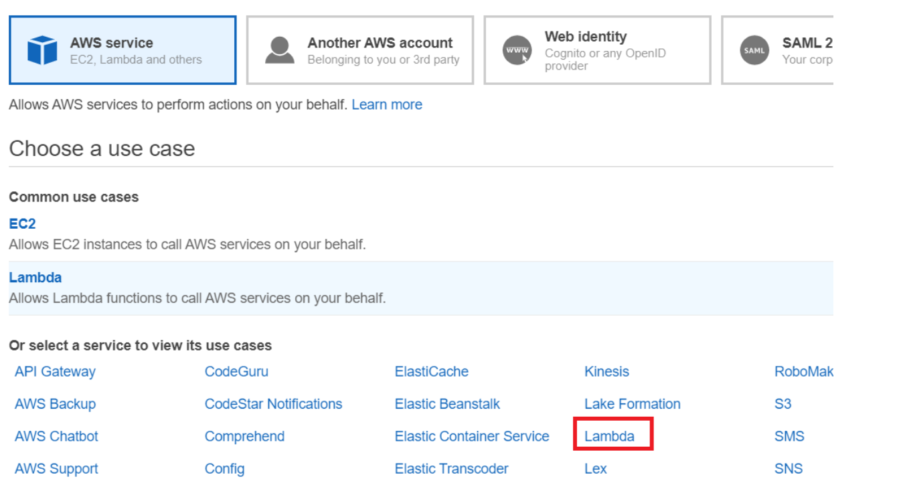

4. Elige **Permisos**.

5. Busca **AWSLambdaBasicExecutionRole**.

6. Elige **Siguiente: Etiquetas**.

7. Elige **Revisar**.

8. Nombra el rol **lambda-support**.

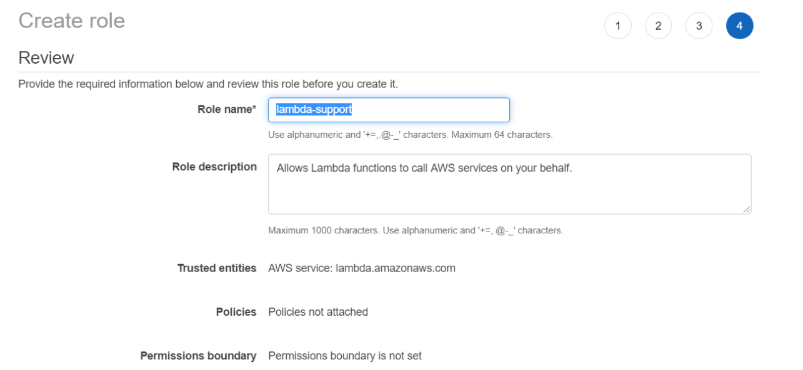

9. Elige **Crear rol**.

10. Elige **lambda-support** para ver la página de descripción general.

11. Elige **Adjuntar políticas**.

12. Busca **AmazonDynamoDBFullAccess**, y luego elige **Adjuntar política**.

13. Busca **AmazonSNSFullAccess**, y luego elige **Adjuntar política**. Cuando termines, podrás ver los permisos.

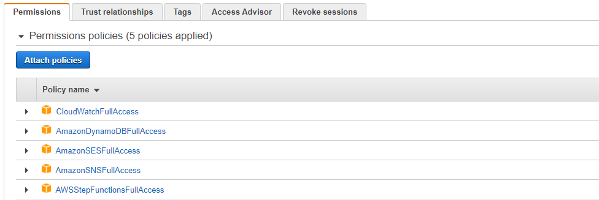

## Crear un proyecto de IntelliJ llamado LambdaCronFunctions

1. En el IDE de IntelliJ, elige **Archivo**, **Nuevo**, **Proyecto**.

2. En el cuadro de diálogo **Nuevo Proyecto**, elige **Maven**, y luego elige **Siguiente**.

3. Para **GroupId**, ingresa **LambdaCronFunctions**.

4. Para **ArtifactId**, ingresa **LambdaCronFunctions**.

5. Elige **Siguiente**.

6. Elige **Finalizar**.

## Añadir las dependencias POM a tu proyecto

En este punto, tienes un nuevo proyecto llamado **LambdaCronFunctions**.

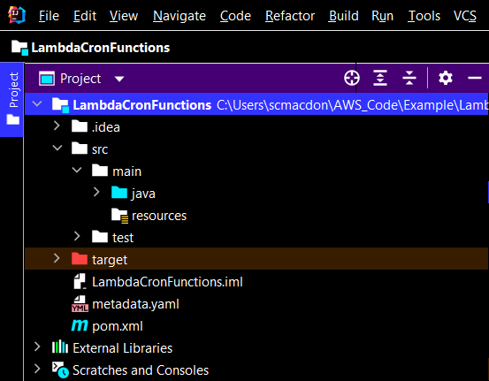


El archivo `pom.xml` se ve como el siguiente.

```xml
<?xml version="1.0" encoding="UTF-8"?>
<project xmlns="http://maven.apache.org/POM/4.0.0"
         xmlns:xsi="http://www.w3.org/2001/XMLSchema-instance"
         xsi:schemaLocation="http://maven.apache.org/POM/4.0.0 http://maven.apache.org/xsd/maven-4.0.0.xsd">
   <modelVersion>4.0.0</modelVersion>
   <groupId>LambdaCronFunctions</groupId>
   <artifactId>LambdaCronFunctions</artifactId>
   <version>1.0-SNAPSHOT</version>
   <packaging>jar</packaging>
   <name>java-basic-function</name>
   <properties>
     <project.build.sourceEncoding>UTF-8</project.build.sourceEncoding>
     <maven.compiler.source>1.8</maven.compiler.source>
     <maven.compiler.target>1.8</maven.compiler.target>
   </properties>
   <dependencies>
    <dependency>
        <groupId>com.amazonaws</groupId>
        <artifactId>aws-lambda-java-core</artifactId>
        <version>1.2.1</version>
    </dependency>
    <dependency>
        <groupId>com.google.code.gson</groupId>
        <artifactId>gson</artifactId>
        <version>2.8.9</version>
    </dependency>
    <dependency>
        <groupId>org.apache.logging.log4j</groupId>
        <artifactId>log4j-api</artifactId>
        <version>2.17.0</version>
    </dependency>
    <dependency>
        <groupId>org.apache.logging.log4j</groupId>
        <artifactId>log4j-core</artifactId>
        <version>2.17.0</version>
        <scope>test</scope>
    </dependency>
    <dependency>
        <groupId>org.apache.logging.log4j</groupId>
        <artifactId>log4j-slf4j18-impl</artifactId>
        <version>2.17.0</version>
        <scope>test</scope>
    </dependency>
    <dependency>
        <groupId>org.junit.jupiter</groupId>
        <artifactId>junit-jupiter-api</artifactId>
        <version>5.8.2</version>
        <scope>test</scope>
    </dependency>
    <dependency>
        <groupId>org.junit.jupiter</groupId>
        <artifactId>junit-jupiter-engine</artifactId>
        <version>5.8.2</version>
        <scope>test</scope>
    </dependency>
    <dependency>
        <groupId>com.googlecode.json-simple</groupId>
        <artifactId>json-simple</artifactId>
        <version>1.1.1</version>
    </dependency>
    <dependency>
        <groupId>software.amazon.awssdk</groupId>
        <artifactId>dynamodb-enhanced</artifactId>
        <version>2.17.110</version>
    </dependency>
    <dependency>
        <groupId>software.amazon.awssdk</groupId>
        <artifactId>dynamodb</artifactId>
        <version>2.17.110</version>
    </dependency>
    <dependency>
        <groupId>software.amazon.awssdk</groupId>
        <artifactId>sns</artifactId>
        <version>2.17.110</version>
    </dependency>
    <dependency>
        <groupId>org.apache.maven.plugins</groupId>
        <artifactId>maven-surefire-plugin</artifactId>
        <version>3.0.0-M5</version>
        <type>maven-plugin</type>
    </dependency>
  </dependencies>
  <build>
    <plugins>
         <plugin>
            <groupId>org.apache.maven.plugins</groupId>
            <artifactId>maven-shade-plugin</artifactId>
            <version>3.2.2</version>
            <configuration>
                <createDependencyReducedPom>false</createDependencyReducedPom>
            </configuration>
            <executions>
                <execution>
                    <phase>package</phase>
                    <goals>
                        <goal>shade</goal>
                    </goals>
                </execution>
            </executions>
        </plugin>
        <plugin>
            <groupId>org.apache.maven.plugins</groupId>
            <artifactId>maven-compiler-plugin</artifactId>
            <version>3.8.1</version>
            <configuration>
                <source>1.8</source>
                <target>1.8</target>
            </configuration>
        </plugin>
    </plugins>
  </build>
</project>
```

## Crear una función Lambda utilizando la API de tiempo de ejecución de Java de AWS Lambda

Usa la API de tiempo de ejecución de Java de AWS Lambda para crear la clase Java que define la función Lambda. En este ejemplo, hay una clase Java para la función Lambda y dos clases adicionales necesarias para este caso de uso. La siguiente figura muestra las clases Java en el proyecto. Observa que todas las clases Java están ubicadas en un paquete llamado **com.aws.example**.

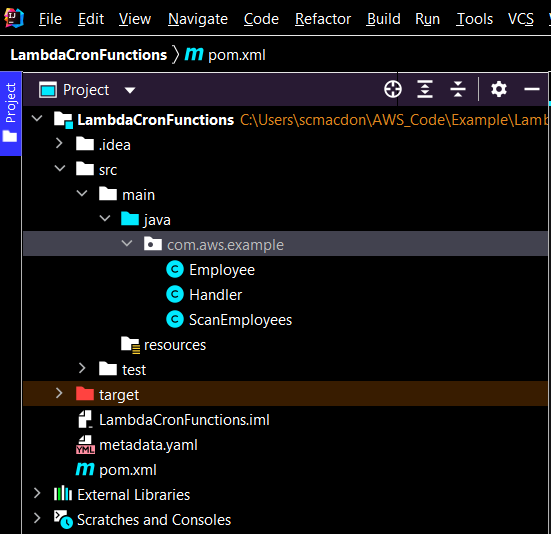

Crea estas clases Java:

+ **Handler** - usada como la función Lambda que realiza el caso de uso descrito en este tutorial de AWS. La lógica de la aplicación que se ejecuta está ubicada en el método **handleRequest**.
+ **ScanEmployees** - usa la API Java V2 de Amazon DynamoDB para escanear la tabla **Employee** usando un objeto **Expression**. Esta clase también usa la API Java V2 de Amazon Simple Notification Service (Amazon SNS) para enviar un mensaje a un empleado.
+ **Employee** - una clase Java que se usa con el cliente mejorado de DynamoDB. Los campos de esta clase coinciden con las columnas en la tabla **Employee**.

### Clase Handler

Este código Java representa la clase **Handler**. La clase crea un objeto **ScanEmployees** e invoca el método **sendEmployeMessage**. Observa que puedes registrar mensajes en los registros de Amazon CloudWatch usando un objeto **LambdaLogger**.

```java
package com.aws.example;

import com.amazonaws.services.lambda.runtime.Context;
import com.amazonaws.services.lambda.runtime.LambdaLogger;

/**
 *  Este es el punto de entrada para la función Lambda
 */

public class Handler {

 public Void handleRequest(Context context) {
    LambdaLogger logger = context.getLogger();
    ScanEmployees scanEmployees = new ScanEmployees();
    Boolean ans =  scanEmployees.sendEmployeMessage();
    if (ans)
        logger.log("Messages sent: " + ans);
    return null;
 }
}
```

### Clase ScanEmployees

La clase **ScanEmployees** utiliza tanto la API Java V2 de Amazon DynamoDB como la API Java V2 de Amazon SNS. En el siguiente ejemplo de código, observa el uso de un objeto **Expression**. Este objeto se usa para devolver empleados que tienen una fecha de inicio de hace un año. Para cada empleado devuelto, se envía un mensaje de texto usando el método **publish** del objeto **SnsClient**.

```java
package com.aws.example;

import software.amazon.awssdk.enhanced.dynamodb.DynamoDbEnhancedClient;
import software.amazon.awssdk.enhanced.dynamodb.DynamoDbTable;
import software.amazon.awssdk.enhanced.dynamodb.Expression;
import software.amazon.awssdk.enhanced.dynamodb.TableSchema;
import software.amazon.awssdk.enhanced.dynamodb.model.ScanEnhancedRequest;
import software.amazon.awssdk.regions.Region;
import software.amazon.awssdk.services.dynamodb.DynamoDbClient;
import software.amazon.awssdk.services.dynamodb.model.AttributeValue;
import software.amazon.awssdk.services.sns.SnsClient;
import software.amazon.awssdk.services.sns.model.PublishRequest;
import software.amazon.awssdk.services.sns.model.SnsException;
import java.text.DateFormat;
import java.text.SimpleDateFormat;
import java.time.LocalDateTime;
import java.time.ZoneId;
import java.time.format.DateTimeFormatter;
import java.util.*;

/*
 Envía un mensaje de texto a cualquier empleado que haya alcanzado la marca de un año de aniversario.
*/

public class ScanEmployees {

    public Boolean sendEmployeMessage() {

        Boolean send = false;
        String myDate = getDate();

        Region region = Region.US_WEST_2;
        DynamoDbClient ddb = DynamoDbClient.builder()
                .region(region)
                .build();

        // Crear un cliente mejorado de DynamoDb y usar el objeto DynamoDbClient
        DynamoDbEnhancedClient enhancedClient = DynamoDbEnhancedClient.builder()
                .dynamoDbClient(ddb)
                .build();

        // Crear un objeto DynamoDbTable basado en Employee
        DynamoDbTable<Employee> table = enhancedClient.table("Employee", TableSchema.fromBean(Employee.class));

        try {
            AttributeValue attVal = AttributeValue.builder()
                .s(myDate)
                .build();

            // Obtener solo los elementos en la tabla Employee que coincidan con la fecha
            Map<String, AttributeValue> myMap = new HashMap<>();
            myMap.put(":val1", attVal);

            Map<String, String> myExMap = new HashMap<>();
            myExMap.put("#startDate", "startDate");

            Expression expression = Expression.builder()
                .expressionValues(myMap)
                .expressionNames(myExMap)
                .expression("#startDate = :val1")
                .build();

            ScanEnhancedRequest enhancedRequest = ScanEnhancedRequest.builder()
                .filterExpression(expression)
                .limit(15) // puedes aumentar este valor
                .build();

            // Obtener elementos en la tabla Employee
            Iterator<Employee> employees = table.scan(enhancedRequest).items().iterator();

            while (employees.hasNext()) {
                Employee employee = employees.next();
                String first = employee.getFirst();
                String phone = employee.getPhone();

                // ¡Enviar un mensaje de aniversario!
                sentTextMessage(first, phone);
                send = true;
            }
        } catch (DynamoDbException e) {
            System.err.println(e.getMessage());
            System.exit(1);
        }
        return send;
    }

    // Usar el servicio Amazon SNS para enviar un mensaje de texto
    private void sentTextMessage(String first, String phone) {

        SnsClient snsClient = SnsClient.builder()
                .region(Region.US_WEST_2)
                .build();
        String message = first + " feliz primer aniversario. ¡Estamos muy contentos de que hayas estado trabajando aquí durante un año!";

        try {
            PublishRequest request = PublishRequest.builder()
                    .message(message)
                    .phoneNumber(phone)
                    .build();

            snsClient.publish(request);
        } catch (SnsException e) {
            System.err.println(e.awsErrorDetails().errorMessage());
            System.exit(1);
        }
    }

    public String getDate() {

        String DATE_FORMAT = "yyyy-MM-dd";
        DateFormat dateFormat = new SimpleDateFormat(DATE_FORMAT);
        DateTimeFormatter dateFormat8 = DateTimeFormatter.ofPattern(DATE_FORMAT);

        Date currentDate = new Date();
        System.out.println("date : " + dateFormat.format(currentDate));
        LocalDateTime localDateTime = currentDate.toInstant().atZone(ZoneId.systemDefault()).toLocalDateTime();
        System.out.println("localDateTime : " + dateFormat8.format(localDateTime));

        localDateTime = localDateTime.minusYears(1);
        String ann = dateFormat8.format(localDateTime);
        return ann;
    }
}
```

### Clase Employee

La clase **Employee** se usa con el cliente mejorado de DynamoDB y asigna los miembros de datos de **Employee** a elementos en la tabla **Employee**. Observa que esta clase usa la anotación **@DynamoDbBean**.

```java
package com.aws.example;

import software.amazon.awssdk.enhanced.dynamodb.mapper.annotations.DynamoDbBean;
import software.amazon.awssdk.enhanced.dynamodb.mapper.annotations.DynamoDbPartitionKey;
import software.amazon.awssdk.enhanced.dynamodb.mapper.annotations.DynamoDbSortKey;

@DynamoDbBean
public class Employee {

    private String Id;
    private String first;
    private String phone;
    private String startDate;

    public void setId(String id) {
        this.Id = id;
    }

    @DynamoDbPartitionKey
    public String getId() {
        return this.Id;
    }

    public void setStartDate(String startDate) {
        this.startDate = startDate;
    }

    @DynamoDbSortKey
    public String getStartDate() {
        return this.startDate;
    }

    public void setPhone(String phone) {
        this.phone = phone;
    }

    public String getPhone() {
        return this.phone;
    }

    public void setFirst(String first) {
        this.first = first;
    }

    public String getFirst() {
        return this.first;
    }
}
```

## Empaquetar el proyecto que contiene las funciones Lambda

Empaqueta el proyecto en un archivo .jar (JAR) que puedas desplegar como una función Lambda utilizando el siguiente comando Maven.

    mvn package

El archivo JAR se encuentra en la carpeta **target** (que es una subcarpeta de la carpeta del proyecto).

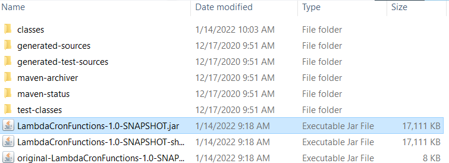

**Nota**: Observa el uso del **maven-shade-plugin** en el archivo POM del proyecto. Este plugin es responsable de crear un JAR que contiene las dependencias necesarias. Si intentas empaquetar el proyecto sin este plugin, las dependencias requeridas no se incluirán en el archivo JAR y te encontrarás con una **ClassNotFoundException**.

## Desplegar la función Lambda

1. Abre la consola de Lambda en https://us-east-1.console.aws.amazon.com/lambda/home.

2. Elige **Crear función**.

3. Elige **Autor desde cero**.

4. En la sección **Información básica**, ingresa **cron** como nombre.

5. En **Tiempo de ejecución**, elige **Java 8**.

6. Elige **Usar un rol existente**, y luego elige **lambda-support** (el rol IAM que creaste).

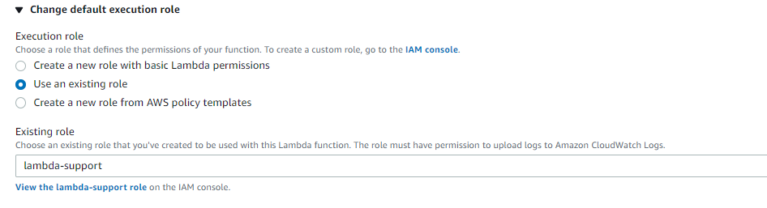

7. Elige **Crear función**.

8. Para **Tipo de entrada de código**, elige **Cargar un archivo .zip o .jar**.

9. Elige **Cargar** y luego busca el archivo JAR que creaste.

10. Para **Controlador**, ingresa el nombre completo de la función, por ejemplo, **com.aws.example.Handler::handleRequest** (**com.aws.example.Handler** especifica el paquete y la clase seguida de :: y el nombre del método).

11. Elige **Guardar**.

## Configurar Amazon API Gateway para invocar la función Lambda

Puedes usar la consola de Amazon Gateway API para crear un endpoint REST para la función Lambda. Una vez hecho esto, podrás invocar la función Lambda utilizando una llamada RESTful.

1. Inicia sesión en la consola de Amazon API Gateway en https://console.aws.amazon.com/apigateway.

2. En Rest API, elige **Build**.

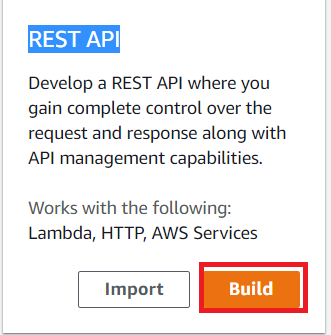

3. Selecciona **Nueva API**.

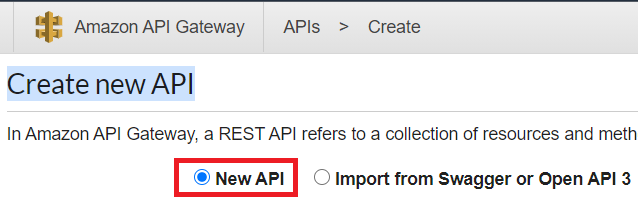

4. Especifica **Employee** como nombre de la API y proporciona una descripción.

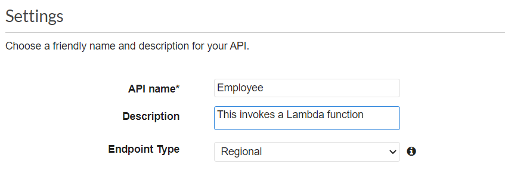

5. Elige **Crear API**.

6. Elige **Recursos** en la sección **Employee**.

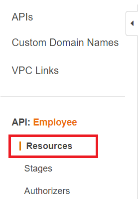

7. Desde el menú desplegable **Acciones**, elige **Crear recursos**.

8. En el campo de nombre, especifica **employees**.

9. Elige **Crear recursos**.

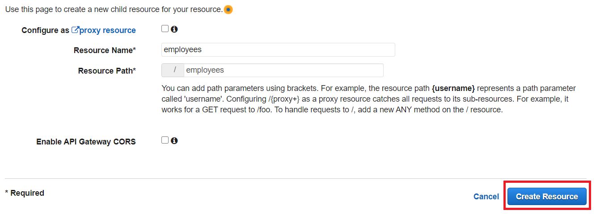

10. Elige **/employees** y luego selecciona GET en el menú desplegable. Elige el ícono de marca de verificación.

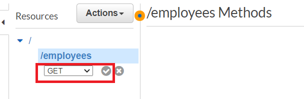

11. Elige **Función Lambda** e ingresa **cron** como nombre de la función Lambda. Elige **Guardar**.

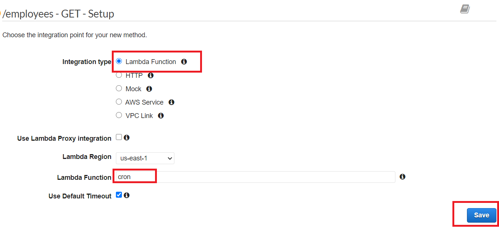

12. Elige **OK**.

### Probar el método de Amazon API Gateway

En este punto del tutorial, puedes probar el método de Amazon API Gateway que invoca la función Lambda **cron**. Para probar el método, elige **Test**, como se muestra en la siguiente ilustración.

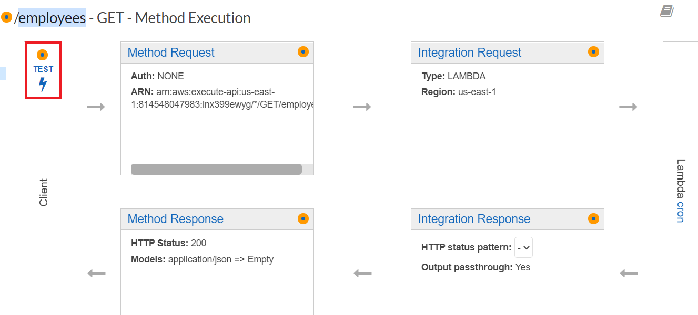

Una vez que la función Lambda se invoca, puedes ver el archivo de registro para ver un mensaje de éxito.

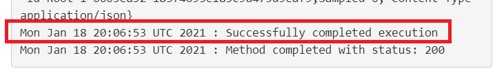

### Desplegar la API

Después de que la prueba sea exitosa, puedes desplegar el método desde la Consola de Administración de AWS.

1. Elige **Get**.

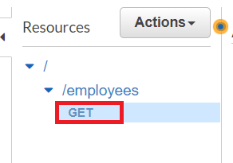

2. Desde el menú desplegable **Acciones**, selecciona **Desplegar API**.

3. Llena el formulario de Desplegar API y elige **Desplegar**.

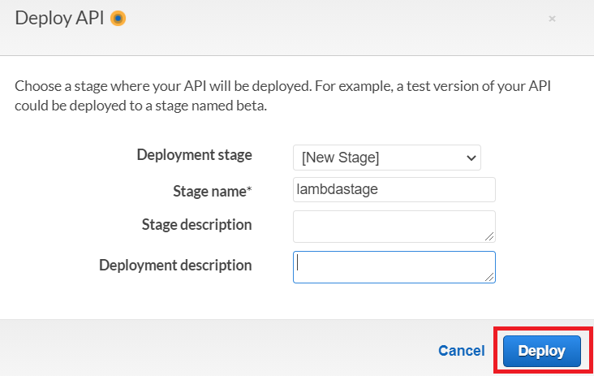

4. Nota que se muestra una URL.

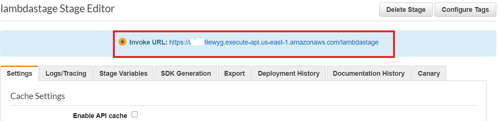

5. Elige **Guardar cambios**.

6. Elige **Get** nuevamente y nota que la URL cambia. Esta es la URL de invocación que puedes usar para invocar la función Lambda.

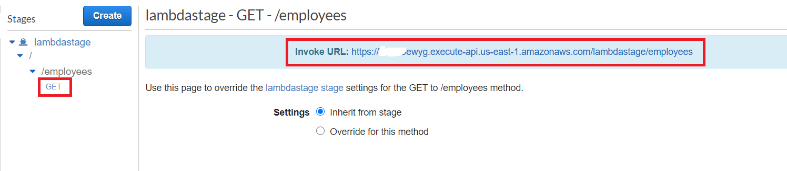

### Próximos pasos
Felicidades, has creado una función AWS Lambda que se invoca utilizando un método de Amazon Gateway API. Como se indicó al principio de este tutorial, asegúrate de terminar todos los recursos que creaste durante este tutorial para garantizar que no se te cobren.

Para más ejemplos de uso de múltiples servicios de AWS, consulta [usecases](https://github.com/awsdocs/aws-doc-sdk-examples/tree/master/javav2/usecases).